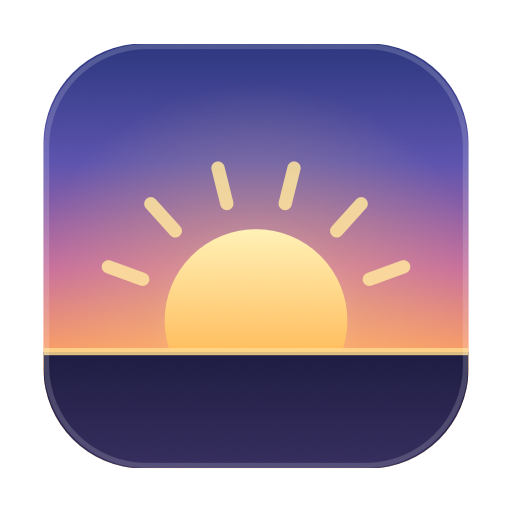
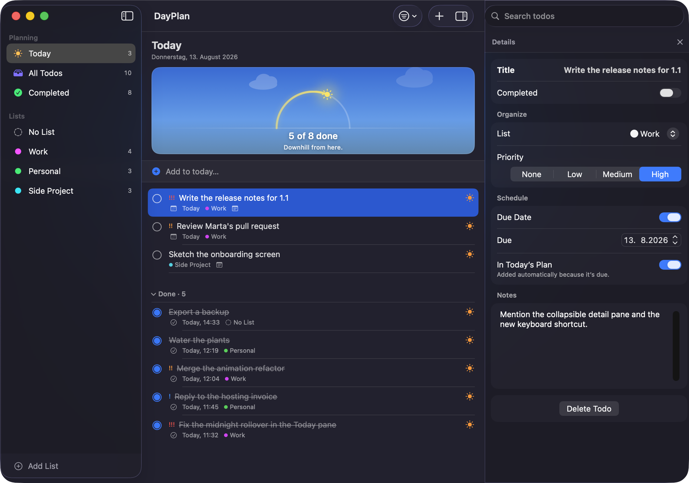
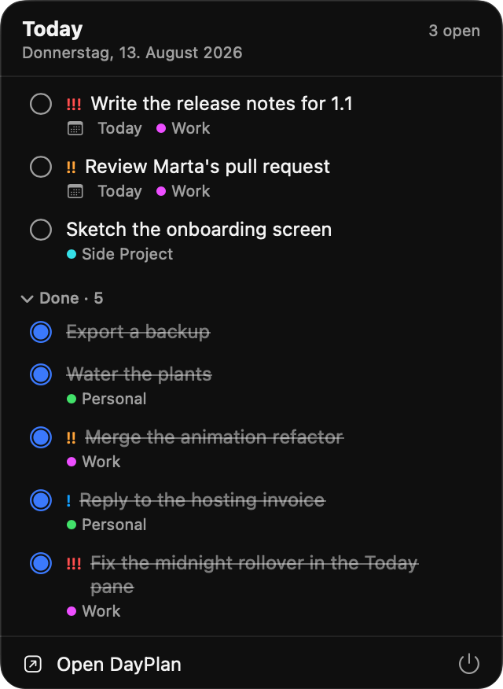
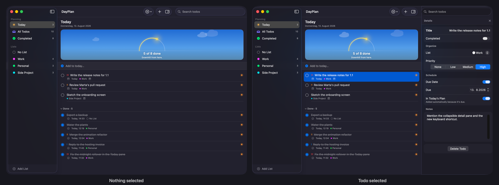

<div align="center">



# DayPlan

**A macOS todo app built on one idea: a todo joins a day on purpose.**

Anything due today shows up by itself, and you can take it back out without lying about when it's due.

<a href="#install"></a>
<a href="https://swift.org"></a>
<a href="Package.swift"></a>
<a href="LICENSE"></a>

<br><br>



<br><br>

[Overview](#overview) · [Why I built it](#why-i-built-it) · [Install](#install) · [Languages](#languages) · [How it works](#how-it-works) · [Your data](#your-data) · [License](#license)

</div>

## Overview

- **A day you decide on.** Todos due today turn up on their own, but you can also pin something
  into today or push it out again, and its due date never moves. That is the part other todo apps
  don't do.
- **A Today pane with a day arc** that fills as you finish things, so where you are is one glance
  rather than a count.
- **A menu bar popover** showing what's still open. Same process, same store as the main window,
  so there is nothing to sync.
- Lists with colours, priorities, due dates and notes. Smart sort puts due dates first, then
  priority, then age, and search covers titles and notes.
- **A detail pane that leaves when you're done with it**, on Escape, the ✕, or ⌥⌘I.
- **Local and yours.** One SwiftData store on your disk, no account, no network, no telemetry, plus
  JSON backups you can read without the app.
- No third-party dependencies. Plain SwiftUI and SwiftData on macOS 15.

## Why I built it

I used Microsoft Teams Planner at work for a long time, and it never once answered the question
I actually had in the morning. A task sits in a bucket, the bucket sits in a plan, the plan sits
in a team channel. Nothing spans those. If you're on six boards, you open six boards and put the
day together in your head. The roll-up views that are supposed to fix that were out of sync often
enough that I stopped trusting them, and adding a task took long enough that I'd lose the thought
before the form finished loading.

So I wanted something local and fast that was honest about what a day is.

Most todo apps treat "today" as a filter over due dates. That fails in both directions. You can't
put a todo with no due date into today, and you can't take something out of today without moving
its due date and lying to yourself about it. DayPlan stores the decision instead. A todo is in
today because it's due, or because you put it there, or it's out because you took it out. What you
did by hand beats the automatic rule, and only for that one day.

<div align="center">
  
  <br><br>
  
</div>

## Install

Needs macOS 15 or newer and a Swift 6 toolchain (Xcode 16).

```bash
git clone https://github.com/benedom/DayPlan.git
cd DayPlan
./build.sh
open DayPlan.app
```

`build.sh` does a release build, renders the icon, assembles the bundle and signs it ad-hoc.

### Gatekeeper

Ad-hoc signing is fine when you build it yourself. A copy that came through a download will be
quarantined and won't open. Right-click it and choose Open, or clear the flag:

```bash
xattr -dr com.apple.quarantine DayPlan.app
```

## Languages

The interface is English only. There are no localization files yet, so every string in the UI is
hardcoded English.

Dates, times and weekday names are a different matter: those go through `DateFormatter` and
`Calendar`, so they already follow your system locale and first day of the week. On a German
system the Today pane reads "Donnerstag, 13. August 2026" under an English heading.

Adding a language means pulling the UI strings into a String Catalog. Roughly 120 of them, mostly
in `RootView.swift`, `TodoListPane.swift`, `TodoDetailPane.swift` and `MenuBarView.swift`. Pull
requests welcome.

## How it works

**The daily plan.** `Todo` carries a `pinnedDay` and an `excludedDay`. Either one overrides the
due-date rule, for that day only. The whole thing is about fifteen lines in
[`Models.swift`](Sources/DayPlan/Models.swift), under `isInDailyPlan(on:includeOverdue:)`.

**A store that fails softly.** [`StoreLoader.swift`](Sources/DayPlan/StoreLoader.swift) tries the
store on disk, and if that fails it moves the files into a timestamped `Quarantined/` folder and
starts fresh. If even that fails it runs from memory and tells you so. It never deletes anything,
because "the app ate my data" and "the app started empty" look identical from the outside.

**A pinned schema.** [`Schema.swift`](Sources/DayPlan/Schema.swift) fixes the shipped shape at V1
behind a `SchemaMigrationPlan`. Any future model change has to be written as a real migration
stage instead of quietly riding on whatever the source happens to look like that week.

**Backups you can read without the app.** Plain versioned JSON, and importing either merges or
replaces ([`Backup.swift`](Sources/DayPlan/Backup.swift)).

**One set of animation curves.** Every timing in both UIs comes from
[`Motion.swift`](Sources/DayPlan/Motion.swift), so a row in the menu bar moves like the same row
in the main window.

**One process.** `WindowGroup` and `MenuBarExtra` live in the same `App` and share a single
`ModelContainer` ([`DayPlanApp.swift`](Sources/DayPlan/DayPlanApp.swift)). No sync code, because
there's nothing to sync.

## Your data

It's all in `~/Library/Application Support/DayPlan/DayPlan.store`. No network, no telemetry, no
account. Anything recovered from a broken store ends up in a `Quarantined/` folder next to it.

Two environment variables move that out of the way, which is how the screenshots above are made
without touching a real store:

```bash
DAYPLAN_STORE_DIR=/tmp/dayplan-demo \
DAYPLAN_SEED_DEMO=1 \
  ./DayPlan.app/Contents/MacOS/DayPlan
```

`DAYPLAN_STORE_DIR` picks a different store location. `DAYPLAN_SEED_DEMO=1` fills it with a sample
day, but only when that store is completely empty, so it can never overwrite anything you care
about.

## License

MIT, see [LICENSE](LICENSE).
